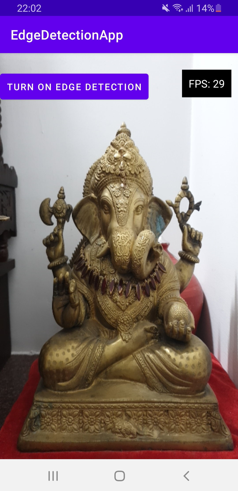
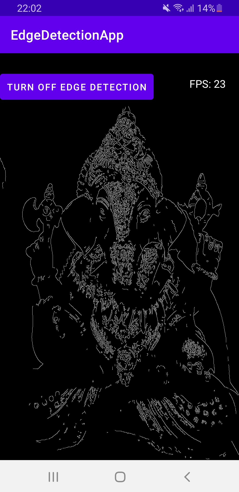
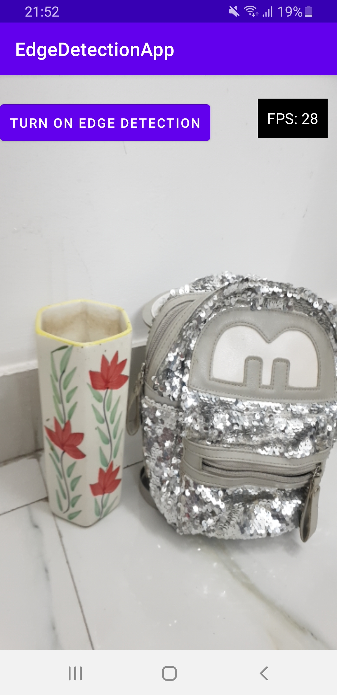
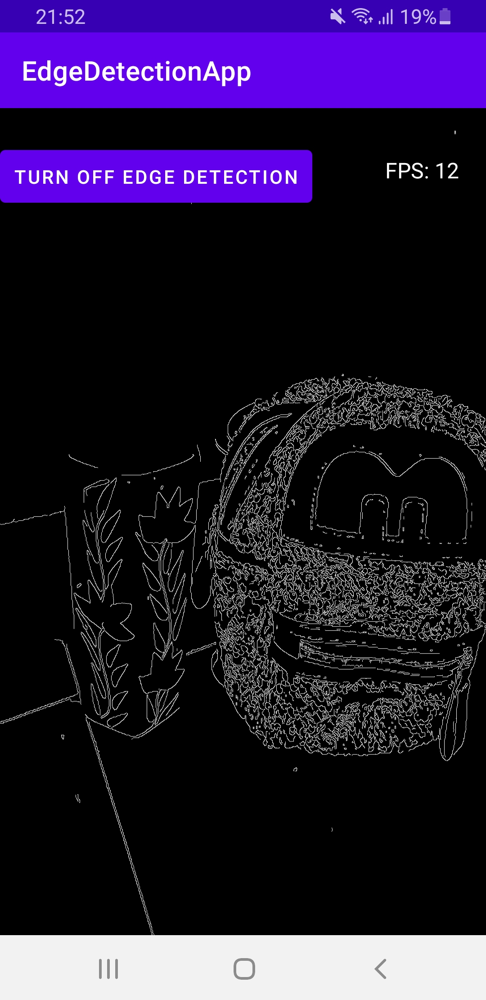

# Edge Detection App

An android app that uses its integrated camera to detect the edges using openCV sdk and renders out the output using openGL lib, it also includes a toggle button to turn on/off the edge detection mode.

## Features

1. Camera Integration  
   The app captures the live video feed from the integrated camera of the device.
2. Edge Detection using OpenCV  
   Real time Edge processing is done using OpenCV's edge detection techniques.(Here i am using canny)
3. OpenGl Rendering  
   The processed data is rendered out using openGl Library for a better and smooth visualisation.
4. FPS Meter  
   A FPS meter is displayed on right side of the screen to monitor the rendered performance.
5. Toggle Edge Detection  
   A toggle button which help users to toggle on/off the edge detection mode or to see the original camera feed.

## Setup Instructions

1. Clone the repository  
   ``` git clone https://github.com/Bhavesh-Kapur/EdgeDetection-App.git ```

2. The openCV android sdk is already pushed in the repo for easier setup
3. Open ```CMakeList``` file which can be found at ```app/src/main/cpp/CMakeLists.txt``` of the project directory.
4. Update the OpenCV_DIR with the correct path in your machine, we need the path to native folder of the sdk will look like this ```OpenCV-android-sdk/sdk/native/jni```
5. Connect an android device either using USB or over Wifi (make sure the device has USB Debugging and Wireless Debugging. If you don't have a device, Android Studio will create an virtual device).
6. Run the project by clicking the Green Play button that builds the project and starts the app on the device.


## Screenshots 
**Before Edge Detection**   


**After Edge Detection**    



**Before Edge Detection**     


**After Edge Detection**    



Few More screenshots are present at ```./screenshots```


## Downloadable App Link
The apk for the app can be downloaded using this <a href="https://drive.google.com/file/d/16RxlqlsDK_AlvH4zC8YhsDDsv8RvvaD5/view?usp=sharing"> link </a>